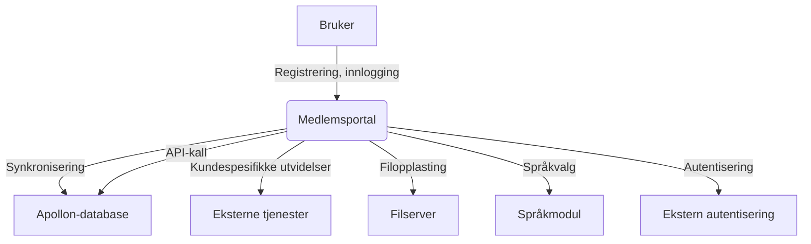

# Apollon Medlemsportal – Kravspesifikasjon (BiConcepts)

Medlemsportalen for utøvere og produsenter driftes vanligvis på en separat server av sikkerhetshensyn. Webapplikasjonen kan tilpasses kundens visuelle profil og konfigureres for alle språk. Brukerne kan velge språk via nettsiden. I tillegg til standardfunksjonalitet kan det implementeres kundespesifikke utvidelser (f.eks. RSS-feed, ekstern autentisering). Data mellom Apollon-databasen og medlemsportalens database synkroniseres regelmessig, og enkelte data hentes direkte via API-kall mot Apollon-serveren.

## Arkitektur

Medlemsportalen inneholder følgende (standard) funksjoner:

### Registrering

- Medlem kan registrere seg via webapplikasjonen.
- Krav til datafelt avklares med kunden (typisk navn, adresse, bankinformasjon, e-post osv.).
- Opplasting av filer kan konfigureres.
- Ekstern autentisering kan integreres (ikke standard, men teknisk mulig).
- Innlogging via ekstern autentisering er inkludert i tilbudet.

#### Illustrasjon av arkitektur

### Registreringsprosess

- Etter registrering mottar medlemmet en e-post med verifikasjonslenke.
- Medlemmet må bekrefte e-postadressen via lenken.
- En ansatt i vederlagsorganisasjonen må verifisere registreringen og tilknytte utøver/produsent/agent fra Apollon-applikasjonen.

### Innlogging

- Innlogging skjer med registrert e-postadresse og passord.
- E-postadressen må være knyttet til minst én utøver, produsent eller agent.
- Flere utøvere/produsenter kan knyttes til samme e-postadresse.
- Flere kontoer kan opprettes for én utøver eller produsent.

### Administrasjon av masterdata

- Medlemmet kan vise og endre egne personopplysninger.
- Hvilke datafelt som vises og kan endres avklares med kunden.
- Endringer kan overføres til Apollon-databasen med eller uten verifikasjonsprosess.

### Mine innspillinger

- Viser liste over alle innspillinger hvor medlemmet er oppført i besetningen.
- Datafelt og visning kan tilpasses.
- Resultatlisten kan filtreres og sorteres.
- Listen kan lastes ned som Excel- eller PDF-fil.

### Min bruk

- Viser alle innspillinger med sendetid hvor medlemmet er oppført.
- Visningsfelter kan konfigureres.
- Standard gruppering etter år, kanal og innspilling.
- Listen kan filtreres, sorteres og lastes ned.

### Mine avspilte innspillinger

- Viser alle innspillinger med tildelt fordelingsbeløp.
- Standard gruppering etter år, kanal og innspilling.
- Listen kan filtreres, sorteres og lastes ned.

### Mine oppgjør

- Viser alle transaksjoner (krediteringer og utbetalinger).
- For kreditnotaer fra kundedistribusjon vises fordeling på ulike rettigheter.
- Alle krediteringer/debiteringer fra eksterne kilder vises.
- Oppgjørsdokumenter kan lastes ned.

## Rapportering og administrasjon

### Rapportering av repertoar

- Medlemmer kan rapportere eller endre innspillinger.
- Følgende data kan registreres/redigeres:
  - Innspilling (masterdata)
  - Utøverbesetning
  - Produsentbesetning
  - Produktinformasjon
  - Kommentarer
  - Opplasting av vedlegg
- Arbeidsflyt og tilgang kan tilpasses kundespesifikt.

### Agenter

- Agenter kan administrere sine medlemmer, legge til/fjerne medlemmer.
- Verifikasjonsprosess kan defineres.
- Agenter kan se innspillings- og oppgjørsdata for sine medlemmer og laste ned data.

### Verifikasjonsside (kun for ansatte)

- Viser alle ventende endringer i en liste.
- Ansatte kan godkjenne eller avvise endringer.
- Godkjente endringer synkroniseres automatisk til Apollon-databasen.

### Logg ut

- Medlemmet kan logge ut aktivt.
- Økten avsluttes automatisk etter inaktivitet.

## Definisjoner av gap-løsninger

| Id   | Krav                                 | Løsning                                                                                 |
|------|--------------------------------------|-----------------------------------------------------------------------------------------|
| G.20 | Claiming-funksjonalitet              | Rettighetshavere kan kreve innspillinger. Ekstra sider for administrasjon av repertoar. |
| G.21 | Rapportering av repertoar            | Rettighetshavere kan laste opp repertoar via mal (Excel). Validering og stagingområde.  |
| G.22 | Innlogging med ID (to-faktor)        | Valgfritt: To ID-leverandører, Vonage for to-faktor (SMS).                             |
| G.23 | Signering av kontrakt                | Brukeren kan signere kontrakt under registrering.                                       |
| G.24 | Dashboard “Årlig oppsummering”       | Ny side for å vise vederlag og kostnadsprosenter.                                       |
| G.25 | Varsling om nye dokumenter           | Varsler fra Apollon vises på første side etter innlogging.                              |
| G.26 | Vise manglende informasjon           | Viser informasjon om manglende data (f.eks. bankkonto) på første side.                  |
| G.27 | Registrering for selskaper           | API-kall mot registreringsmyndighet for verifisering av selskapsdata.                   |
| G.28 | Endringer i besetning: Send e-post   | Ved endringer sendes e-post til alle rettighetshavere.                                  |
